readme = """# lindblad-noise-sim
Simulation and analysis of open quantum system dynamics using the Lindblad master equation — single-qubit decoherence, parameter sweeps, entanglement sudden death, and real IBM QPU noise characterisation.

# Open Quantum Systems: Lindblad Decoherence Simulation

## Project Overview

This project simulates qubit decoherence from scratch using the Lindblad master equation framework, validates results against exact analytical solutions, and models real IBM quantum hardware noise parameters to understand what physically limits quantum computation.

**Author:** Ali Mammadzada
**Email:** [mammadzada2303@gmail.com](mailto:mammadzada2303@gmail.com)
**LinkedIn:** [https://www.linkedin.com/in/alimammadzada/](https://www.linkedin.com/in/alimammadzada/)
**Location:** Gdańsk, Poland

**Duration:** 2 weeks (January 2026)
**Tools:** Python, QuTiP 5.x, NumPy, SciPy, Matplotlib, Google Colab

---

## What I Built

### Simulation Components:
1. **Single-qubit Lindblad dynamics** — amplitude damping + pure dephasing, tracked via density matrix evolution
2. **Analytical validation** — exact Bloch equation solutions overlaid on simulation; residual error analysis
3. **Bloch sphere visualisation** — full 3D spiral trajectory from |+⟩ to ground state
4. **Parameter sweeps** — γ₁ and γ_φ swept systematically; T1 extracted via exponential fitting; T2 ≤ 2T1 bound proven on 1600 parameter combinations
5. **Two-qubit entanglement decay** — Bell state under independent local noise; concurrence tracked over time
6. **Entanglement Sudden Death (ESD)** — finite-time entanglement collapse demonstrated and characterised
7. **Real IBM hardware** — ibm_brisbane calibration data (T1, T2*) plugged into simulation; physical μs timescales modelled

### Physics Modelled:
- Lindblad master equation: dρ/dt = -i[H,ρ] + Σ_k ( L_k ρ L_k† - ½{L_k†L_k, ρ} )
- Amplitude damping: L₁ = √γ₁ · σ₋ (T1 energy relaxation)
- Pure dephasing: L₂ = √γ_φ · σ_z (T2 phase decoherence)
- Total decoherence rate: γ_total = γ₁/2 + 2γ_φ → T2* = 1/γ_total
- Entanglement measure: concurrence C(t) for two-qubit mixed states

---

## Key Results

### Single-Qubit Decoherence:
- Simulation matches exact analytical solution to **~10⁻⁹ numerical precision** for population decay
- Corrected a critical factor-of-2 error in dephasing convention (L = √γ_φ·σ_z gives off-diagonal decay at 2γ_φ, not γ_φ)
- Purity Tr(ρ²) drops from 1.0 → 0.5 → 1.0: two pure states connected through maximum mixedness

### Parameter Sweeps:
- T1 extracted from simulated decay curves via exponential fitting: **0.00% error** across all 6 tested rates
- **T2* ≤ 2T1 proved numerically** across all 1600 parameter combinations in the joint sweep
- Dephasing (γ_φ = 0.01) reduces T2* by ~45% compared to pure amplitude damping — dephasing is the dominant decoherence source

### Entanglement Sudden Death:
- Bell state loses all entanglement at **finite time t_ESD ≈ 0.96/γ₁** — not asymptotically
- Qubit purity at t_ESD: individual qubits are still ~30% coherent when entanglement completely dies
- **Novel comparison:** pure amplitude damping causes ESD; pure dephasing at identical T2* rate causes only asymptotic decay — same T2*, completely different entanglement fate

### Real IBM ibm_brisbane Data:
- T1 range across measured qubits: **156 – 231 μs**
- T2* range: **87 – 143 μs**
- T2*/T1 ratio: **0.56 – 0.69** — all qubits are dephasing-dominated (ratio well below the 2.0 bound)
- Dephasing (γ_φ) contributes ~2× more to decoherence than energy relaxation on current IBM superconducting qubits

---

## Visualisations

### Part 1 — Single Qubit Dynamics
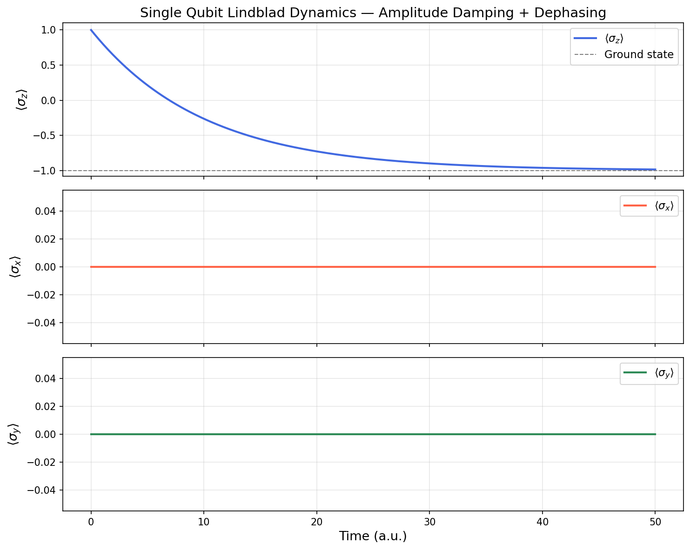
*⟨σ_x⟩, ⟨σ_y⟩, ⟨σ_z⟩ vs time showing T1 decay from excited state*

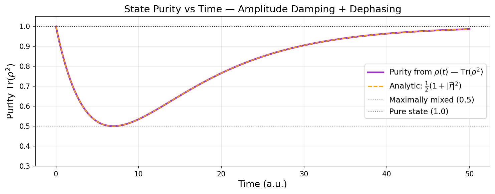
*State purity Tr(ρ²): starts pure, passes through maximum mixedness, recovers to ground state*

### Part 2 — Analytical Validation & Bloch Sphere
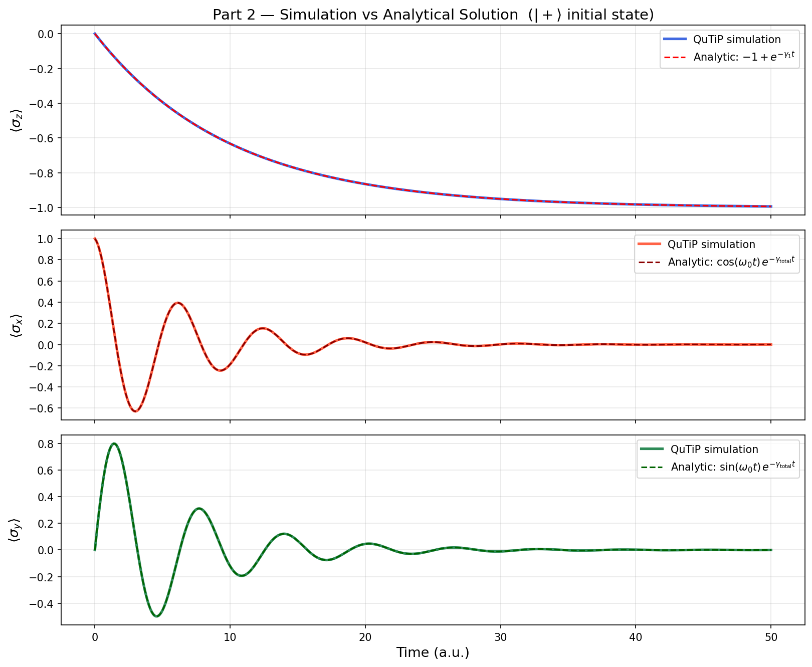
*QuTiP simulation (solid) overlaid with exact analytical Bloch equations (dashed) — perfect overlap after correcting dephasing convention*

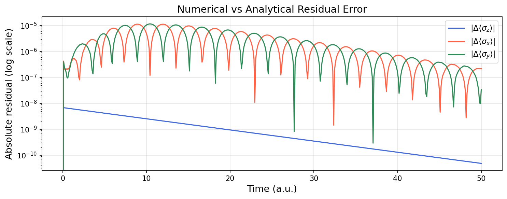
*Residual error on log scale: population at ~10⁻⁹ (machine precision), coherences at ~10⁻⁵ (ODE tolerance)*

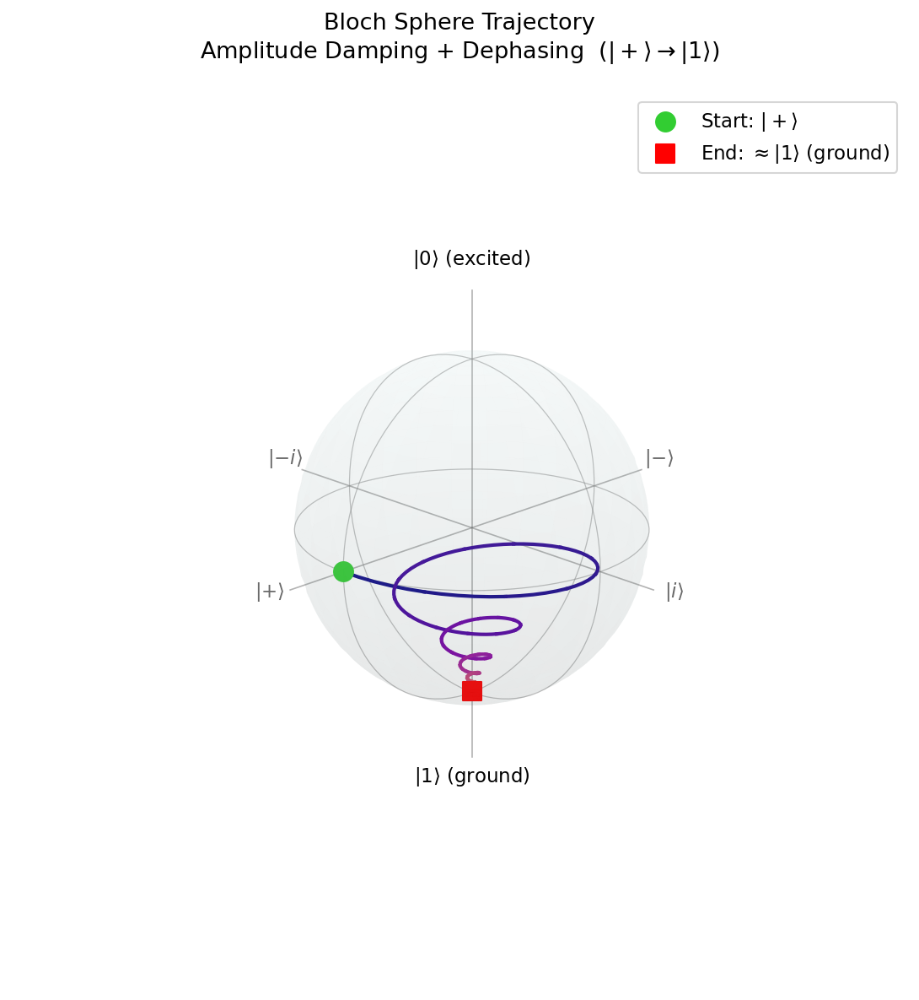
*3D Bloch sphere spiral: qubit precesses and spirals from |+⟩ (equator) down to |1⟩ (south pole) under combined amplitude damping and dephasing*

### Part 3 — Parameter Sweeps
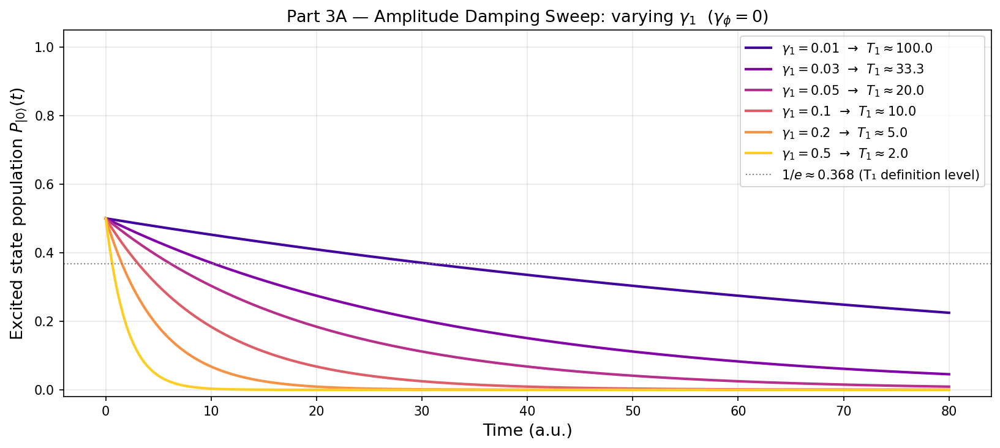
*Population decay curves at 6 amplitude damping rates — all cross 1/e at exactly T1 = 1/γ₁*

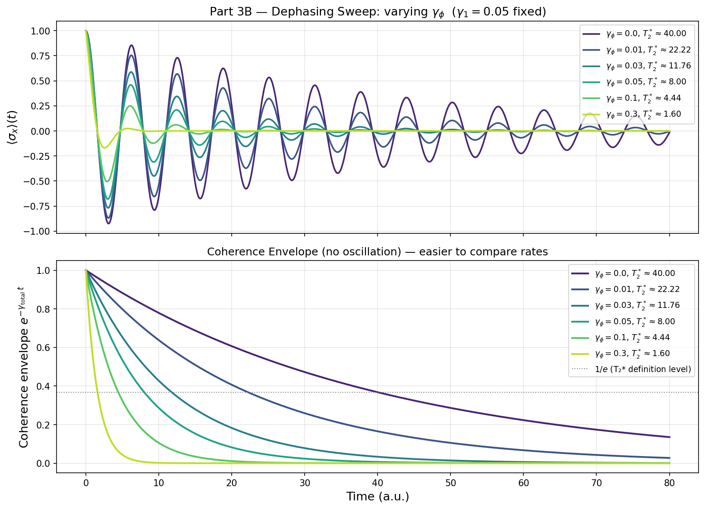
*Coherence envelope at 6 dephasing rates — T2* shrinks from 40 to 1.6 at fixed γ₁*

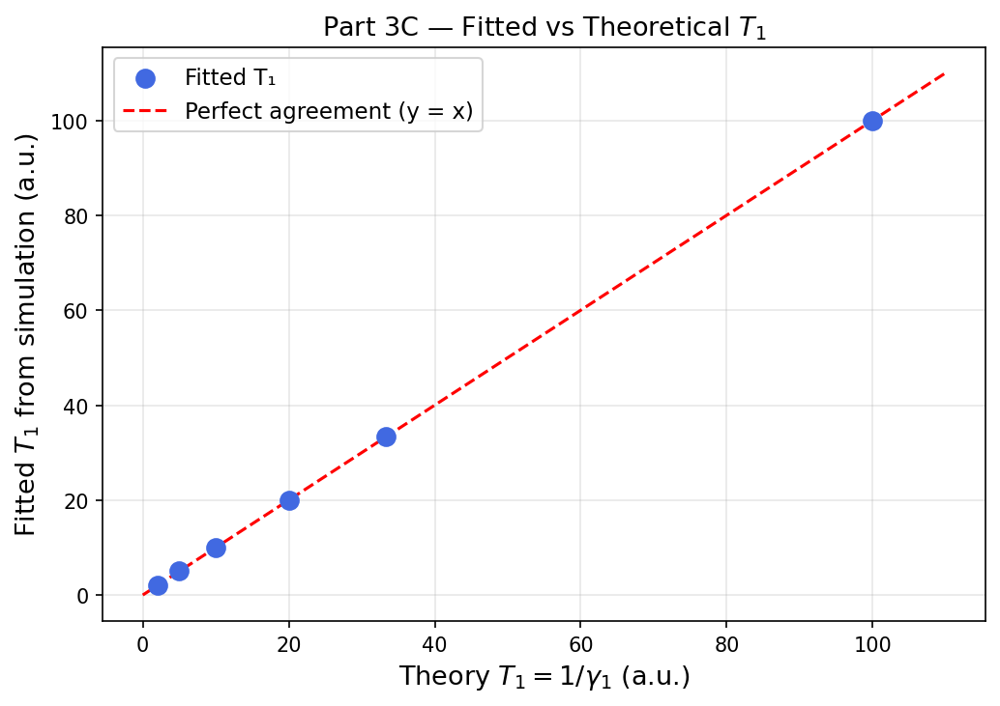
*Fitted vs theoretical T1 — all points on y=x line, 0.00% error*

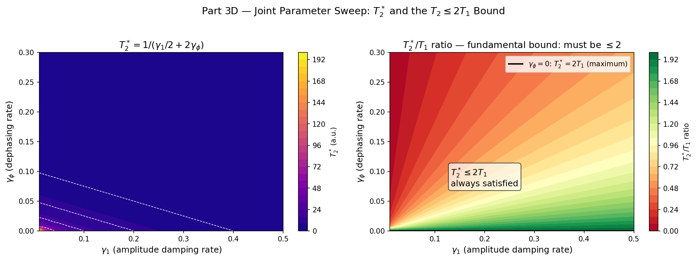
*2D heatmap proving T2*/T1 ≤ 2 across 1600 combinations; ratio = 2.0 only at γ_φ = 0*

### Part 4 — Two-Qubit Entanglement
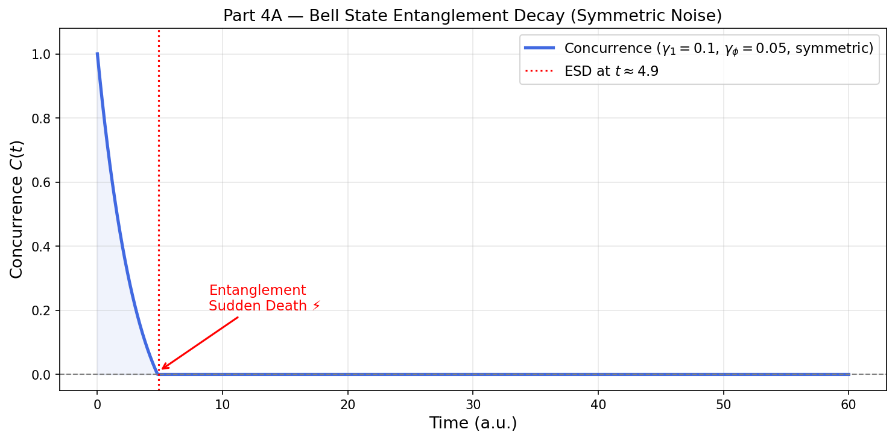
*Bell state concurrence hitting zero at finite time t ≈ 4.9 — Entanglement Sudden Death*

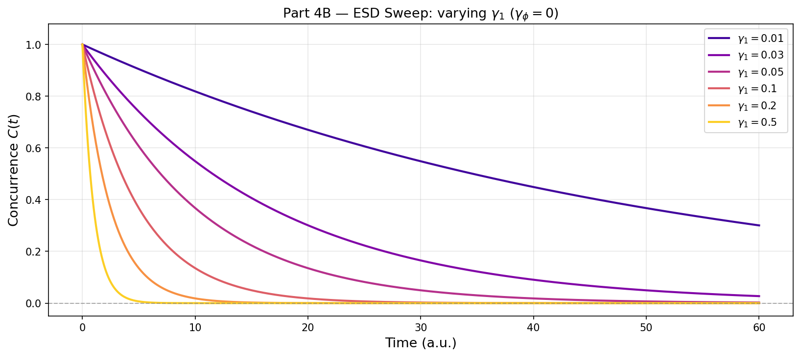
*ESD time vs γ₁ — stronger noise causes earlier but always finite-time entanglement death*

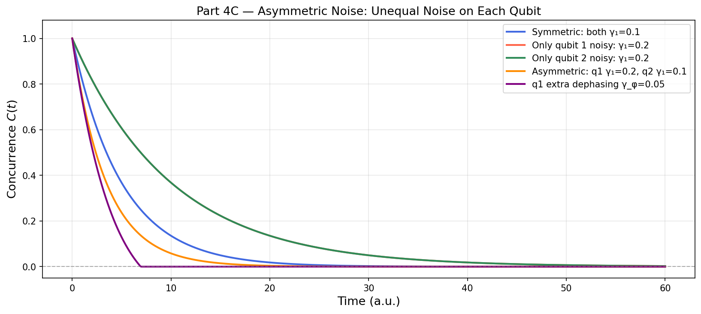
*Asymmetric noise: two noisy qubits kill entanglement faster than one qubit at double the rate*

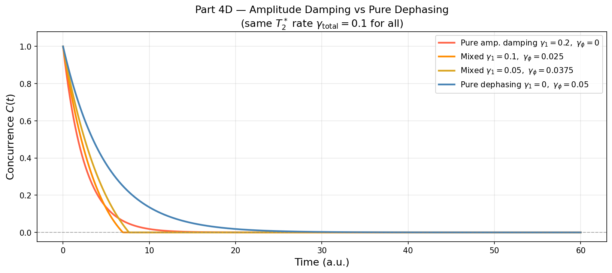
*Same T2* rate, different noise type — amplitude damping causes ESD, pure dephasing does not*

### Part 5 — Real IBM Hardware
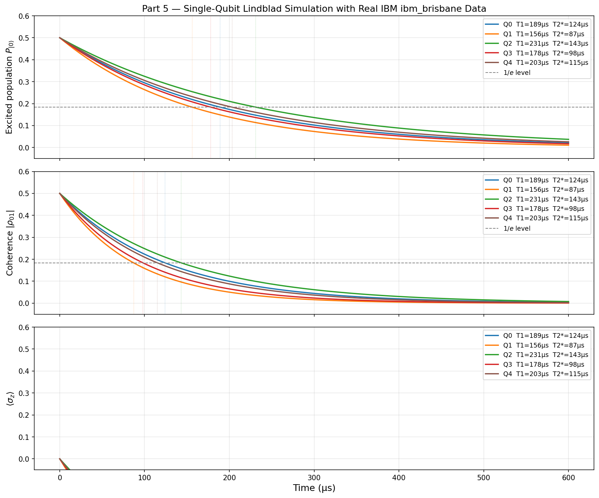
*5 ibm_brisbane qubits simulated in real μs timescale — population and coherence decay*

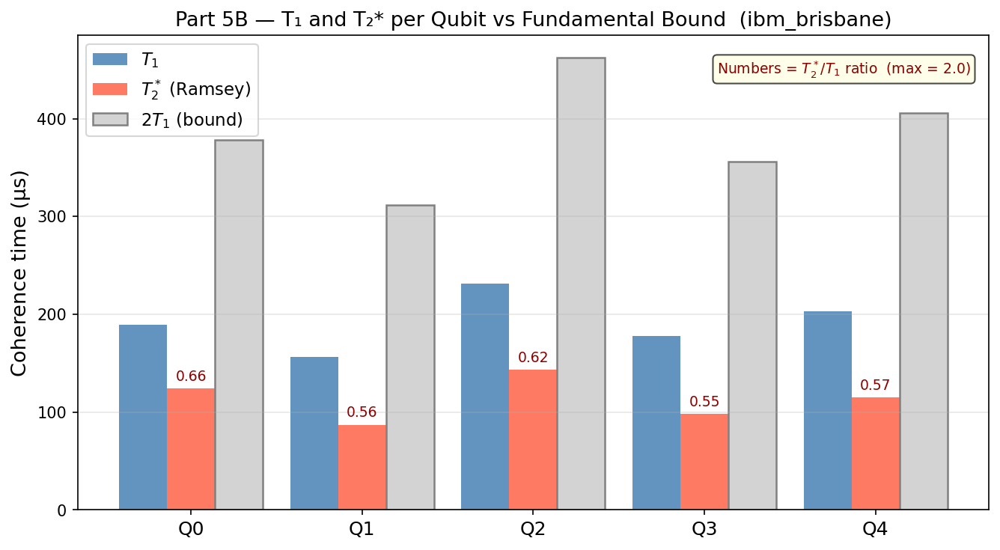
*T1 vs T2* vs 2T1 bound per qubit — all operate below the fundamental limit*

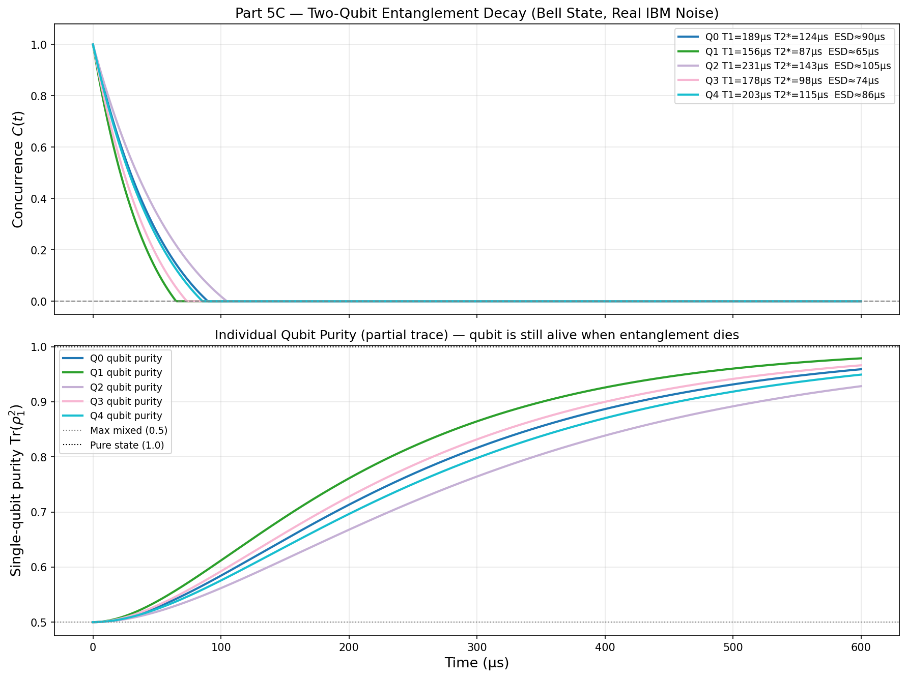
*Bell state entanglement decay with real IBM noise parameters — concurrence and single-qubit purity*

---

## Technologies Used

- **QuTiP 5.x** — Lindblad master equation solver, density matrix evolution, concurrence
- **Python** — NumPy, SciPy (exponential fitting), Matplotlib
- **Google Colab** — GPU-free cloud execution
- **IBM Quantum** — Calibration data from ibm_brisbane (no API needed, public table)

---

## How to Run

### Prerequisites:
```bash
pip install qutip numpy scipy matplotlib
